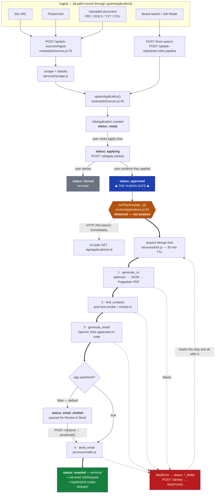

# Architecture

How a job becomes a sent email, and where the work actually runs.

## Services

| Service | Stack | Port | Role |
|---|---|---|---|
| `client` | Next.js 15 (App Router) | 3000 | Web UI |
| `server` | Node 20, Express 5, Mongoose | 5000 | API, pipeline orchestration, email, scraping |
| `optimizer` | Python 3.11, FastAPI, SQLite | 8002 | Turns a JD + resume into a structured JSON resume |
| `extension` | Chrome MV3 | – | 1-click outreach from a LinkedIn job page |

MongoDB is the primary datastore. The optimizer is internal — reachable only as
`http://optimizer:8002` from the server.

---

## Request flow: ingestion to send

---

## Stage notes

**Ingest.** Four entry paths, one creation funnel (`upsertApplication`,
`routes/jobSources.js:40`). Links found inside pasted text or an uploaded document are
themselves scraped as jobs; text with no links becomes a job on its own. Re-ingesting a job
the user has already acted on will not clobber it (`jobSources.js:62`).

**The human gate.** `ready → applying → approved`. The pipeline cannot start, and no email
can be sent, without passing through `approved`. The FSM (`services/applicationFsm.js:7`)
enforces this — a stale client cannot skip the gate or push an application backwards.

**Detached execution — the current architectural limit.** `routes/applications.js:63` calls
`runPipeline(app._id)` **without awaiting it**. The HTTP response returns immediately and
the UI polls `GET /api/applications/:id` for progress.

> This means a crash or a deploy mid-run **orphans the work**. There is no queue, so no
> automatic retry and no separate worker scaling. On the next boot,
> `sweepInterruptedSteps()` (`server.js:131`, defined in `applicationFsm.js:92`) finds steps
> left `running` by a process that no longer exists and marks them errored, so the UI offers
> a retry instead of spinning forever. That is damage control, not recovery — the user must
> click retry.
>
> The fix is a real job queue (BullMQ + Redis), with each `STEP_ORDER` entry becoming a job
> with its own retry policy. `pipeline.js` is already shaped for this: discrete steps,
> persisted state, and `retryFrom` for partial re-runs.

**Concurrency.** `services/lock.js` gives cross-replica mutual exclusion so two replicas
cannot run the same pipeline or radar scan. The in-process `localRuns` map additionally lets
a second call join an in-flight run rather than starting a competing one.

**Background jobs.** All three are cron-driven and safe under replication because they claim
each row atomically via `claimDueJobs` (`services/jobClaim.js`):

| Service | Schedule | Purpose |
|---|---|---|
| `initReminderService` (`services/reminderService.js:15`) | `FOLLOW_UP_CRON`, hourly | Sends AI-written follow-ups on unanswered outreach |
| `initScheduledSendService` (`routes/jobs.js:235`) | `SCHEDULED_SEND_CRON`, every minute | Sends emails queued for a future time |
| `initReplyTrackingService` (`services/replyTrackingService.js`) | IMAP poll | Classifies replies (interview / info / rejection / other). **Off unless `ENABLE_REPLY_TRACKING=true`** |

Every replica *runs* both cron schedules; the atomic claim makes that correct but wasteful.
Past a couple of replicas, run crons on one dedicated instance and set the cron env vars
empty elsewhere.

**LLM boundary.** Every model call goes through `services/llm.js`, which centralises retries,
the retryable-vs-permanent error taxonomy, and JSON-Schema structured output. Twelve call
sites, all single-shot — there are no agent loops or tool-calling flows today.
